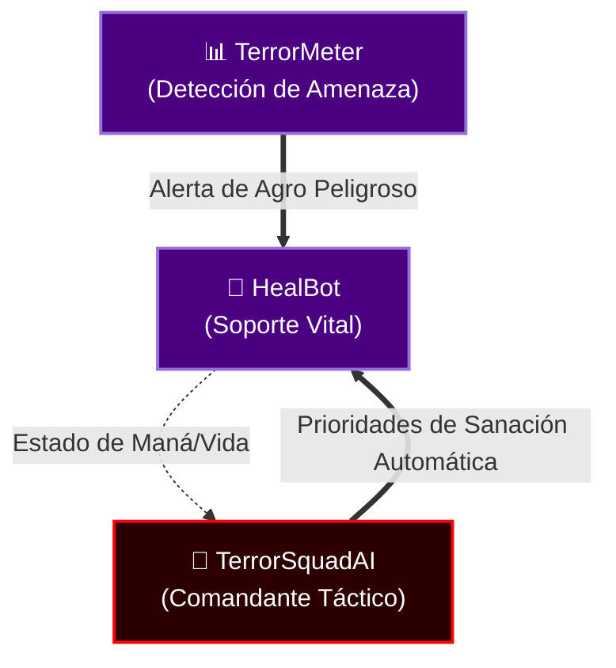

═══════════════════════════════════════════════════════════════════════════════
  HealBot - Edición El Séquito del Terror
  Versión Máximo Nivel v4.0 para Turtle WoW
═══════════════════════════════════════════════════════════════════════════════

Desarrollado por: DarckRovert (Elnazzareno)
Clan: El Séquito del Terror
Basado en: HealBot Continued by Strife
Original: Holgaard's HealBot

═══════════════════════════════════════════════════════════════════════════════
  CARACTERÍSTICAS PRINCIPALES
═══════════════════════════════════════════════════════════════════════════════

✓ Motor Trilineal: 3 temporizadores (0.2s / 0.5s / 3.0s) para FPS máximo en raid
✓ Barra de salud degradada: verde→amarillo→rojo según porcentaje de HP
✓ Pulso visual para unidades en estado crítico (<20% HP)
✓ Bordes de barra con color de clase WoW (Guerrero naranja, Mago cyan, etc.)
✓ Borde dinámico del panel: morado (paz) o rojo (combate)
✓ StatusEngine unificado: AFK, DND, OFF, FD, RES, THREAT en texto de barra
✓ TerrorMeter Bridge: amenaza alta mostrada en naranja desde el addon del clan
✓ BigWigs Bridge: avisos de boss mostrados en el panel de sanación
✓ Alerta de Agro (ToT) en rojo sobreescribiendo cualquier otro color de borde
✓ 20 combinaciones de teclas+ratón para hechizos
✓ Sincronización inteligente con HealBot, CTRA, TerrorMeter y BigWigs
✓ **Séquito Ecosystem Compatible**: Integración con la red táctica de TerrorSquadAI y WCS_Brain para prioridades de sanación automáticas.
✓ **Localización Completa**: 344 líneas de traducción española (HealBot_Localization.es.lua)

═══════════════════════════════════════════════════════════════════════════════
  NOTA IMPORTANTE
═══════════════════════════════════════════════════════════════════════════════

Para que HealBot funcione correctamente, la función Selfcast en las opciones
de WoW debe estar DESACTIVADA.

═══════════════════════════════════════════════════════════════════════════════
  INSTALACIÓN
═══════════════════════════════════════════════════════════════════════════════

1. Descomprime el archivo y coloca la carpeta HealBot en:
   Interface/AddOns de tu directorio de Turtle WoW
   
   Ruta por defecto:
   E:\\TurtleWow\\Interface\\AddOns\\HealBot

2. Reinicia el juego

3. En la pantalla de selección de personaje, haz clic en "AddOns"

4. Asegúrate de que HealBot esté marcado/activado

═══════════════════════════════════════════════════════════════════════════════
  COMANDOS DE CHAT
═══════════════════════════════════════════════════════════════════════════════

/hb          - Activa/desactiva el panel principal de HealBot
/hb options  - Activa/desactiva el panel de opciones de HealBot
/hb opt      - Alias para opciones
/hb config   - Alias para opciones
/hb cfg      - Alias para opciones
/hb reset    - Reinicia el contenido del panel principal
/hb recalc   - Recalcula hechizos
/hb defaults - Restaura configuración por defecto
/hb ui       - Recarga la interfaz
/hb ver      - Muestra versión

═══════════════════════════════════════════════════════════════════════════════
  REPORTAR ERRORES
═══════════════════════════════════════════════════════════════════════════════

Los errores importantes mostrarán un marco con información del error.
Toma una captura de pantalla y contacta con:

Creador: DarckRovert (Elnazzareno en el juego)
Clan: El Séquito del Terror

═══════════════════════════════════════════════════════════════════════════════
  INTEGRACIÓN CON EL ECOSISTEMA DEL TERROR (SQUADMIND)
═══════════════════════════════════════════════════════════════════════════════

HealBot no está solo; es el **Soporte Vital** de la Red Neural de 10 addons del clan. 
Funciona en simbiosis con el resto de la interfaz para prevenir Wipes.

■ **Conexión con TerrorMeter**:
  Si un DPS roba el aggro del tanque (ToT Alert), TerrorMeter avisa a HealBot en microsegundos.
  El cuadro de ese jugador **parpadeará en ROJO INTENSO**, indicando a los Healers que
  lancen Palabra de Poder: Escudo o Sanación Rápida antes de que el DPS reciba el golpe fatal.

■ **Conexión con TerrorSquadAI**:
  El Cerebro Táctico (TSAI) lee el estado de maná y vida de toda la banda desde HealBot. 
  Si el maná global de los Healers baja del 15%, TSAI ordena automáticamente a los DPS 
  que usen pausas tácticas o mitigación de daño.

■ **Diagrama de la Mente de Enjambre**:

═══════════════════════════════════════════════════════════════════════════════
  CHANGELOG
═══════════════════════════════════════════════════════════════════════════════

v9.3.0 [God-Tier]
-----------------
* Versión interna unificada con ecosistema v9.3.0 God-Tier
* Corrección: HEALBOT_VERSION alineado con TOC (v9.3.0)
* Compatibilidad total con WCS_Brain v9.3.0 (14-Tab Hub)

v3.0 - Advanced Séquito del Terror
------------------------------------
* **Motor de Rendimiento (Phase 1)**: Centralización de bucles de actualización para máximo FPS en bandas de 40.
* **Módulo BlizzDisable**: Opción para desactivar marcos originales de Blizzard y ahorrar CPU.
* **Detección de FD**: Escaneo de buffs real para detectar Cazadores en "Fingir Muerte".
* **Sincronización de Resurreciones**: Muestra quién está siendo resucitado por otros sanadores (RES) para mayor coordinación.
* **Alertas de Agro**: Borde rojo visual cuando un enemigo tiene a un aliado como objetivo (ToT).

v2.0 - El Séquito del Terror
------------------------------
* Interfaz completamente modernizada
* Actualización de créditos y autoría
* Optimización para Turtle WoW
* Corrección de errores de archivos corruptos
* Documentación en español

═══════════════════════════════════════════════════════════════════════════════
  CAMBIOS PRINCIPALES DE VERSIONES ANTERIORES
═══════════════════════════════════════════════════════════════════════════════

v1.126
------
* Nuevas opciones para apuntar y lanzar en barras deshabilitadas
* Indicadores de resurrección añadidos
* Más opciones de tooltips e información en las barras
* Registro con TitanPanel en categoría Interface

v1.125
------
* Opciones de skin para cambiar y guardar la apariencia
* Opciones de decursive compatibles con BC
* Opciones de tooltip mejoradas
* Aumento significativo de rendimiento

v1.124
------
* Botones de ratón medio y derecho añadidos a combo keys

v1.123
------
* Comunicación entre sanadores usando HealBot para mostrar sanaciones entrantes
* Integración con CT_MOD Control Panel y CTRA
* Configuración de opacidad para barras de HealBot
* Configuración de opacidad para indicadores de sanación entrante

═══════════════════════════════════════════════════════════════════════════════
  CRÉDITOS
═══════════════════════════════════════════════════════════════════════════════

Edición Actual:
  DarckRovert (Elnazzareno) - El Séquito del Terror

Desarrollo Previo:
  Strife - HealBot Continued
  Holgaard - HealBot Original

Agradecimientos Especiales:
  A todos los miembros de El Séquito del Terror
  A la comunidad de Turtle WoW
  A todos los contribuidores originales de HealBot

═══════════════════════════════════════════════════════════════════════════════

¡Que la luz te guíe en tus sanaciones!

- DarckRovert (Elnazzareno)
  El Séquito del Terror

═══════════════════════════════════════════════════════════════════════════════
