# 📐 Wiki: Arquitectura 'Diamond Tier' — HealBot [v1.12.0]

Estructura técnica de la orquestación de vida mantenida por **DarckRovert**.

## 🏗️ Jerarquía del Sistema Healing Orchestrator (Life Hierarchy)

**HealBot** opera mediante un motor de estados de unidad de alto rendimiento:

1.  **Status Engine (`HealBot_StatusEngine.lua`)**: El núcleo reactivo que intercepta `UNIT_HEALTH`, `UNIT_AURA` y eventos de combate para reflejar el estado vital de la raid.
2.  **Action Logic (`HealBot_Action.lua`)**: Gestor de la matriz de clics (Click-to-Cast) que traduce interacciones de ratón en el lanzamiento asíncrono de hechizos.
3.  **Threat Monitor (`HealBot_ThreatMonitor.lua`)**: Módulo de intercepción de agro que visualiza quién está en peligro inminente mediante bordes de alerta Diamond Tier.
4.  **UI Core (`HealBot.xml`)**: Define la estructura de los marcos de unidad altamente personalizables y optimizados para el renderizado Apex.

---

## 🧭 Diagrama de Flujo: Proceso de Sanación v9.4

```mermaid
graph TD
    A[Inicio: Salud de Unidad Cambia] --> B[Interceptación de StatusEngine]
    B --> C[Carga de Sanación Predictiva IncHeal]
    C --> D[Actualización Visual de Bar Frame]
    D --> E{¿Tiene Agro o Debuff?}
    E -- Sí --> F[Resalte Visual de Borde / Color Diamond]
    F --> G[Clic de Sanador sobre Marco]
    G --> H[Traducción de Binding en Action.lua]
    H --> I[Lanzamiento de Hechizo Táctico]
    I --> J[Sync con TerrorMeter & WCS_Brain]
    E -- No --> G
```

## ⚡ Estrategias de Ingeniería Diamond Tier

- **Selective Update Throttling**: HealBot v9.4 solo actualiza los marcos de unidad visibles, reduciendo drásticamente las llamadas a la API de Blizzard en encuentros masivos de 40raids.
- **Async Bonus Scanner**: El escaneo de bonos de sanación del equipo se realiza fuera del hilo principal para no afectar la fluidez de respuesta del ratón.
- **Aura Awareness v9.4**: Detección nativa de las mecánicas exclusivas de Turtle WoW (ej: perjuicios de Karazhan) integrada en el motor de Alerts-Tier.

---
© 2026 **DarckRovert** — El Séquito del Terror.
*Soberanía de vida para la conquista de Azeroth.*

